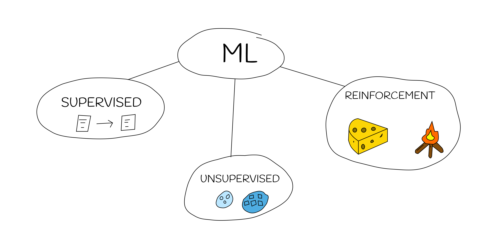

# What is Machine Learning

Machine learning is a subset of AI that learns to make decisions by fitting mathematical models to observed data.

### Applications of Machine Learning

These are a few of the many applications of machine learning:

- Image / Speech Recognition
- Natural Language Processing (NLP)
- Predictive Analysis
- Autonomous Systems

### Types of ML

- Supervised Learning
- Unsupervised Learning
- Reinforcement Learning

